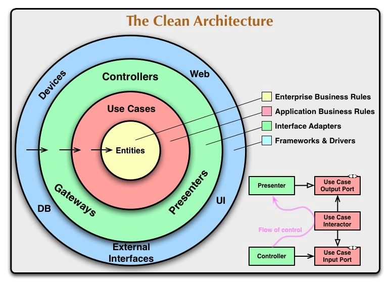

---

## Comparativo: **Clean Architecture** × **Domain-Driven Design (DDD)**

**Referências:**

* **Clean Architecture** → *Robert C. Martin* (Uncle Bob)
* **DDD** → *Eric Evans*

---

### 1. Escopo e abrangência

* **DDD** é **muito mais abrangente** que Clean Architecture.

  * **DDD** não é apenas uma arquitetura — é um **conjunto de princípios, padrões e estratégias** para modelar o **domínio de negócio** de forma fiel e expressiva. Ele envolve desde a **linguagem ubíqua** até o desenho de **agregados, entidades e serviços de domínio**.
  * **Clean Architecture** é **um estilo arquitetural** voltado para **organizar e isolar camadas** de forma a manter o código desacoplado e fácil de testar.
  * Podemos dizer que **DDD se preocupa mais com *o que* e *por que*** (o significado do software para o negócio), enquanto **Clean Architecture se preocupa mais com *como* organizar o código**.

---

### 2. Relação entre DDD e Clean Architecture

* Muitas vezes **usamos padrões do DDD** **dentro** de uma Clean Architecture.
* Por exemplo:

  * Entidades e Value Objects do DDD podem ser usados na camada **Entities** da Clean Architecture.
  * Serviços de aplicação do DDD podem corresponder a **Use Cases** da Clean Architecture.
* Ou seja, **DDD modela o negócio** e **Clean Architecture organiza a aplicação** para manter o domínio protegido do resto do sistema.

---

### 3. O que são *Patterns* (Padrões)

* **Patterns** são soluções testadas e recorrentes para problemas comuns de design de software.

  * Ex.: Repository Pattern, Factory Pattern, Aggregates, Value Object, etc.
* No DDD, muitos conceitos (como Entidade, Value Object, Agregado) são padrões específicos para modelagem do domínio.

---

## Elementos do **DDD**

### a) Domínio (core da aplicação)

* É o **coração do sistema** — onde ficam as regras de negócio reais.

#### **Entidade**

* Possui **identidade única** (ID).
* Armazena **estado** e **comportamento** (regras de negócio).
* **Entidade rica**: mantém comportamento e estado de forma coesa (boa prática no DDD).
* **Entidade anêmica**: armazena apenas estado, sem regras de negócio (evitar no DDD).

#### **Value Object (VO)**

* Não possui identidade própria.
* Representa um conceito imutável (ex.: CPF, coordenada, valor monetário).
* Usado para **descrever atributos** com regras próprias.

#### **Agregado**

* Conjunto de Entidades e/ou VOs com um **Agregado Raiz** que controla o acesso e consistência.

#### **Serviço de Domínio**

* Encapsula regras de negócio que **envolvem múltiplas entidades** ou não pertencem a nenhuma entidade em específico.

---

### b) Camada de Aplicação

#### **Application Service**

* Orquestra o **fluxo de casos de uso** do sistema.
* Típico exemplo:

  1. Recebe dados da entrada.
  2. Cria ou modifica entidades.
  3. Usa repositórios para salvar dados.
  4. Dispara eventos ou envia notificações.

---

### c) Camada de Infraestrutura

* Integra com o **mundo externo** (bancos de dados, filas, APIs externas, etc.).
* No DDD, essa camada **não deve poluir** o domínio com detalhes técnicos.

---

## Elementos da **Clean Architecture**

### a) **Entities**

* Contêm **regras de negócio críticas** (core business rules).
* São independentes de qualquer tecnologia ou framework.
* No contexto de DDD, poderiam corresponder a Entidades + Value Objects + Regras de negócio centrais.

### b) **Use Cases**

* Implementam **regras de negócio específicas da aplicação** (application business rules).
* Orquestram um fluxo completo de intenção do usuário.

  * Um Use Case:

    * Pode criar/alterar entidades.
    * Chama repositórios (via interfaces/gateways).
    * Dispara eventos ou interage com serviços externos.
  * **Importante:** Um Use Case **nunca chama outro Use Case**.

### c) **Gateways / Interfaces**

* Contratos para acesso a recursos externos (bancos, APIs, mensageria).

### d) **External Interfaces**

* Implementações concretas (Infraestrutura).

---

### 🔍 Resumo visual

| Aspecto            | DDD                                                         | Clean Architecture                         |
| ------------------ | ----------------------------------------------------------- | ------------------------------------------ |
| **Foco**           | Modelagem do negócio (linguagem ubíqua, padrões de domínio) | Organização e desacoplamento de camadas    |
| **Escopo**         | Filosofia + padrões de design                               | Estilo arquitetural                        |
| **Entidade**       | Objeto com identidade e comportamento do domínio            | Regras de negócio essenciais               |
| **Serviços**       | Serviço de domínio, serviço de aplicação                    | Use Case (similar ao serviço de aplicação) |
| **Infraestrutura** | Detalhes externos desacoplados do domínio                   | Camada mais externa, não afeta núcleo      |

---